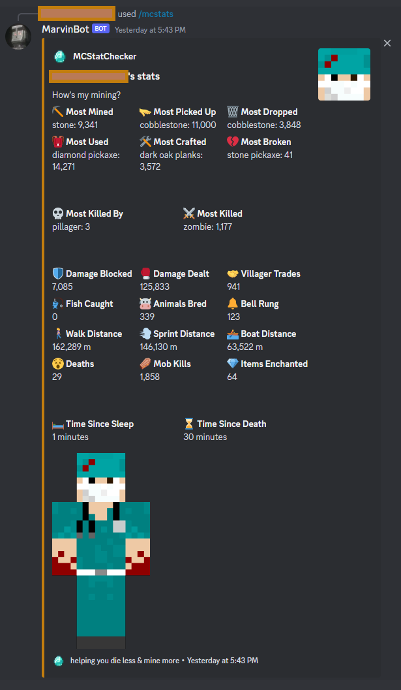

# MarvinBot 🥹

MarvinBot is a Discord bot that uses OpenAI's gpt-turbo-3.5 to seem like an 'over it' chatbot.

Don't worry too much about Marvin, though, he'll be fine.

MarvinBot has a built-in Minecraft stat generator, too, even if he's not a big fan of video games.

At this time, the bot pulls player data from .json files stores in /src/commands/playerStats.

The stats are formatted into an embed. The entire project uses Discord.js.

Express is installed to easily run a server for hosting.

There a few basic slash commands calling on public APIs.

## Current Command List

- 🥃 /ron: random quote from Ron Swanson
- 🐶 /dog: random fact about dogs
- 🖥 /server: quick server details
- 🏓 /ping: check bot ping
- 🆔 /user: echos when the user joined the server
- 💠 /mcstats: custom Minecraft Stat Checker. B.Y.O.J. (Bring Your Own JSON)

Tag MarvinBot (or whatever you name your bot) in a server channel to receive a reply from an OpenAI model.
This code is set to 'gpt-turbo-3.5' for the sake of cost, but this can be easily tweaked in 'src/app.js'.

